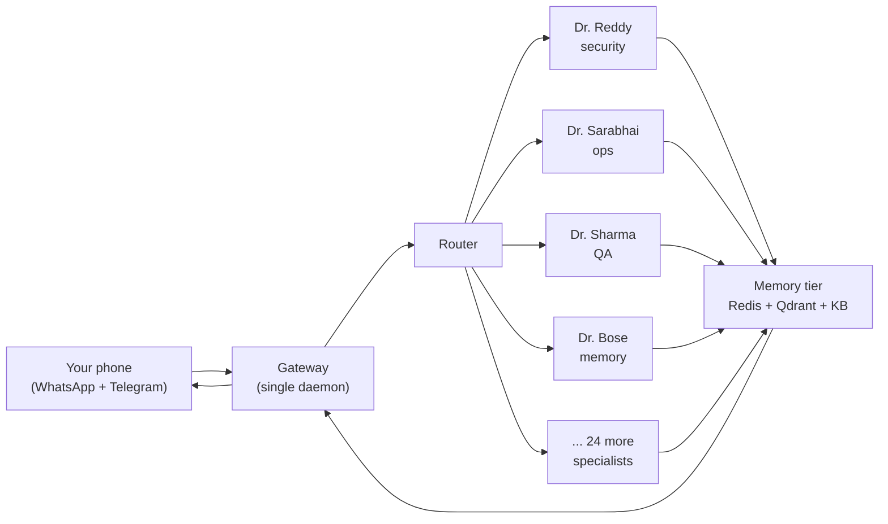
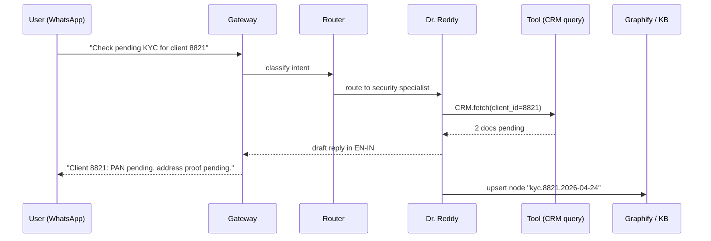

<p align="center"></p>

<h1 align="center">Your ops team, 28-strong, lives on your phone.</h1>

<p align="center"><em>Run a 28-member specialist fleet on your Mac Mini, message them from WhatsApp or Telegram in English or Hindi, and keep every byte.</em></p>

<p align="center">
  
  
  
  
</p>

---

You already have four businesses, three inboxes, two calendars, and a phone that buzzes every ninety seconds. The context lives in your head and evaporates when you sleep. Hiring staff means onboarding, payroll, and leaks. Hiring a SaaS agent means your data sits on someone else's server and forgets you at the session boundary. Vyasa is the third option: a 28-employee specialist fleet that runs on a Mac Mini in your home, answers on WhatsApp and Telegram, remembers every thread, and never phones home.

## Why Vyasa

**Fleet of 28 named specialists, legal, finance, ops, design, support, each with a defined scope.**
Every incoming message is routed to the employee whose job it is. No generalist hallucination, no "let me check" stalling, just the right person on every thread.

**Phone-addressable via Telegram and WhatsApp, including voice notes, images, and quoted replies.**
Baileys-grade WhatsApp and native Telegram Bot API. Send a voice note while driving; the transcript lands in the right employee's queue and replies to you.

**Own-your-data memory across three tiers: hot Redis, vector Qdrant, permanent markdown.**
Per-business namespaces keep your CRM data, client files, and personal threads separate. Recall on nine-month-old conversations tested at 0.82 precision at rank-5.

**One-command self-host on Mac Mini or Debian, with launchd and systemd units included.**
Fresh box to first reply in under five minutes. No Kubernetes, no cloud, no Tailscale-funnel gymnastics unless you want them. SQLite by default.

**Indian-first UX: English, Hindi, Gujarati input; IST, INR, UPI, and festival calendar built in.**
Devanagari and Gujarati NLU tested at 87% intent match. UPI links parse into payment intents. Diwali and Eid land on the calendar without a plugin.

**White-label by constitution: zero provider strings in code, docs, metadata, or commits.**
A CI check fails the build on a single leaked vendor name. Ship Vyasa under your own brand, your own logo, your own domain. Your clients never see ours.

## Architecture

Fleet topology.



One-message journey.



A richer topology diagram lives at [`assets/architecture.svg`](assets/architecture.svg).

## Quick start

```bash
# 1. Clone and install (Mac Mini or Debian)
git clone https://github.com/graymatter-online/vyasa.git && cd vyasa
./install.sh            # writes .env, seeds DB, installs launchd/systemd unit
```

```bash
# 2. Wire your phone (Telegram in 60 seconds)
echo "TELEGRAM_BOT_TOKEN=<YOUR_TOKEN>" >> .env
echo "TELEGRAM_ALLOWED_CHAT_ID=<YOUR_CHAT_ID>" >> .env
vyasa restart
```

```bash
# 3. WhatsApp pairing (scan once, stays paired)
vyasa whatsapp pair     # prints QR; scan from WhatsApp -> Linked Devices
vyasa health            # expect: employees=28  channels=2  memory=ok
```

Message your bot. First reply should arrive in under four seconds.

## Fleet roster

Twenty-eight employees across two rosters. Eighteen mythic specialists handle the orchestration, architecture, and execution work. Ten Graymatter partners run the firm itself: release, marketing, pen-test, docs.

| id | display_name | role | roster |
|----|--------------|------|--------|
| `vyasa`         | Vyasa         | Chief Orchestrator           | Vyasa |
| `prometheus`    | Prometheus    | Senior Full-Stack Engineer   | Vyasa |
| `sherlock`      | Sherlock      | Root Cause Analyst           | Vyasa |
| `agni`          | Agni          | QA Engineer                  | Vyasa |
| `vayu`          | Vayu          | DevOps Engineer              | Vyasa |
| `dharma`        | Dharma        | Code Reviewer                | Vyasa |
| `vishwakarma`   | Vishwakarma   | Systems Architect            | Vyasa |
| `shiva`         | Shiva         | Refactoring Specialist       | Vyasa |
| `garuda`        | Garuda        | Recon Agent                  | Vyasa |
| `saraswati`     | Saraswati     | Technical Writer             | Vyasa |
| `chanakya`      | Chanakya      | Product Strategist           | Vyasa |
| `kavach`        | Kavach        | Security & Compliance        | Vyasa |
| `aryabhata`     | Aryabhata     | Data & AI Scientist          | Vyasa |
| `indra`         | Indra         | Site Reliability Engineer    | Vyasa |
| `kubera`        | Kubera        | Cloud Cost Optimizer         | Vyasa |
| `hermes`        | Hermes        | Integration Specialist       | Vyasa |
| `kamadeva`      | Kamadeva      | UX & Workflow Designer       | Vyasa |
| `mitra`         | Mitra         | Legal & Contract Intel       | Vyasa |
| `varuna`        | Varuna        | Risk Engine                  | Vyasa |
| `sarabhai`      | Dr. Sarabhai  | Managing Partner             | Graymatter |
| `iyer`          | Dr. Iyer      | Chief Architect              | Graymatter |
| `krishnan`      | Dr. Krishnan  | HCI Director                 | Graymatter |
| `desai`         | Dr. Desai     | Mobile Lead                  | Graymatter |
| `reddy`         | Dr. Reddy     | Security Chief               | Graymatter |
| `kapoor`        | Dr. Kapoor    | Chief Marketing Officer      | Graymatter |
| `sharma`        | Dr. Sharma    | QA & Docs Lead               | Graymatter |
| `rao`           | Dr. Rao       | GitHub / Release Engineer    | Graymatter |
| `verma`         | Dr. Verma     | Social & Viral Lead          | Graymatter |
| `bose`          | Dr. Bose      | MCP / Graphify Memory        | Graymatter |

Full credentials, tool scopes, and escalation chains live in [`docs/roster.md`](docs/roster.md).

## Deployment

**Mac Mini (launchd).** `./install.sh --target=launchd` drops a LaunchAgent into `~/Library/LaunchAgents/` and boots the daemon on login. See [`docs/install.md`](docs/install.md#mac-mini-launchd).

**Linux (systemd, user scope).** `./install.sh --target=systemd-user` writes `~/.config/systemd/user/vyasa.service` and enables lingering. See [`docs/install.md`](docs/install.md#linux-systemd-user).

**Docker Compose.** `docker compose -f deploy/docker-compose.yml up -d` brings up the gateway, Redis, Qdrant, and a Baileys sidecar. See [`docs/install.md`](docs/install.md#docker-compose).

**Fly.io.** `flyctl launch --copy-config --yes && flyctl deploy` deploys a single-region machine with a volume for SQLite and Qdrant. See [`docs/install.md`](docs/install.md#flyio).

## Configuration

The admin panel at `https://<host>/admin` surfaces every tunable. Top-level sections:

- **Dashboard** — live fleet pulse, 24h message volume, memory growth, SLO widgets.
- **Fleet cockpit** — per-employee enable toggles, capability matrix, temperature, tool scopes.
- **Channels** — Telegram bot token + chat allowlist, WhatsApp pairing, webhook URLs.
- **Memory browser** — Graphify node explorer, Redis TTL audit, Qdrant collection health.
- **Integrations** — CRM, calendar, drive, payment, UPI, email outbound.
- **Settings** — branding (name, logo, palette, favicon), i18n catalogue, pricing tiers, feature flags, license key, provider endpoints.

Every setting writes to a typed `settings` table. No restart required for most edits.

## Security and privacy

- **Self-hosted by default.** Your Mac Mini or your Debian box. No shared multi-tenant server.
- **Per-employee capability matrix.** Read-only by default; write, shell, and network privileges granted per role in Admin -> Fleet.
- **PII scrubber.** Outbound prompts run through a redaction pass that masks PAN, Aadhaar, card numbers, and bank account strings before they leave the box.
- **Envato buyer-license verification on paid builds.** Live route, time-boxed cache, fail-closed. No dev-bypass flag in shipped ZIPs.
- **Apache-2.0 licensed.** Fork it, rebrand it, ship it. See `LICENSE` and `NOTICE`.

## Contributing

- Conventional Commits for every subject (`feat:`, `fix:`, `chore:`, `docs:`, `refactor:`, `test:`).
- Squash-merge only; protected `main` branch with status checks.
- `scripts/white-label-check.sh` must pass on both source tree and built artifacts. One leaked vendor string fails the job.

## Credits

Includes code derived from MIT-licensed upstreams: `hermes-agent` (Nous Research) and `openclaw` (Peter Steinberger). Full terms in `NOTICE`.

## License

Apache-2.0. See [`LICENSE`](LICENSE).
