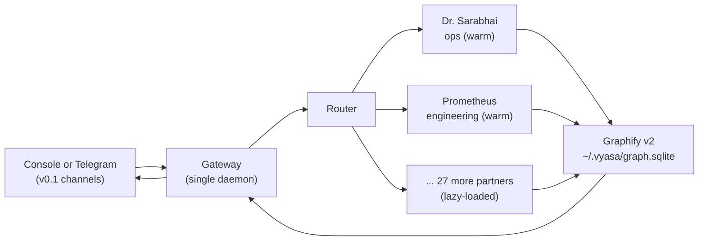
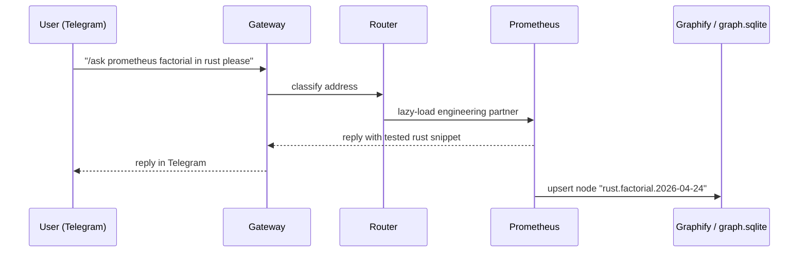

<p align="center"></p>

<h1 align="center">Your ops team, 29-strong, lives on your terminal.</h1>

<p align="center"><em>Run a 29-partner specialist fleet on your Mac Mini, message them from Telegram today and WhatsApp in v0.2, and keep every byte.</em></p>

<p align="center">
  
  
  
  
  
</p>

---

## Status

**Status:** v0.1-alpha (Duo mode). Two partners warm by default
(Dr. Sarabhai + Prometheus), rest lazy-loaded on first address. Console +
Telegram channels functional, WhatsApp arriving in v0.2. Not yet
production-ready. Feedback welcome via GitHub Issues.

---

You already have four businesses, three inboxes, two calendars, and a phone that buzzes every ninety seconds. The context lives in your head and evaporates when you sleep. Hiring staff means onboarding, payroll, and leaks. Hiring a SaaS agent means your data sits on someone else's server and forgets you at the session boundary. Vyasa is the third option: a 29-partner specialist fleet that runs on a Mac Mini in your home, answers on Telegram today and WhatsApp in v0.2, remembers every thread, and never phones home.

## Why Vyasa

**Fleet of 29 named specialists, legal, finance, ops, design, support, each with a defined scope.**
Every incoming message is routed to the employee whose job it is. No generalist hallucination, no "let me check" stalling, just the right person on every thread. Duo mode keeps Dr. Sarabhai and Prometheus warm; the rest lazy-load on first address.

**Phone-addressable via Telegram today, WhatsApp in v0.2.**
Native Telegram Bot API is functional in v0.1-alpha: text, quoted replies, allowlist-gated chats. Baileys-grade WhatsApp sidecar (voice notes, images, multi-device) arrives in v0.2.

**Own-your-data memory on a local graph SQLite store.**
Graphify v2 (`~/.vyasa/graph.sqlite`) holds every node the fleet writes. Per-partner namespaces keep CRM data, client files, and personal threads separate. Vector and hot-cache tiers land in v0.2.

**One-command self-host on Mac Mini or Debian, with launchd and systemd units included.**
`uv tool install vyasa-agent` and `vyasa doctor` is under five minutes on a fresh box. No Kubernetes, no cloud. SQLite by default.

**Indian-first UX on the roadmap.**
v0.1-alpha ships English partner voices. Hindi and Gujarati input, IST defaults, UPI intent parsing, and the festival calendar are the v0.2 scope.

**White-label by constitution: zero provider strings in code, docs, metadata, or commits.**
A CI check fails the build on a single leaked vendor name. Ship Vyasa under your own brand, your own logo, your own domain. Your clients never see ours.

## Architecture

Fleet topology.



One-message journey.



A richer topology diagram lives at [`assets/architecture.svg`](assets/architecture.svg).

## Quick start

```bash
# 1. Install
uv tool install vyasa-agent  # or: pipx install vyasa-agent

# 2. Self-check
vyasa doctor

# 3. Talk to the fleet on your terminal
vyasa gateway serve --console
# Try: /ask sarabhai what's on the roadmap?
# Try: /ask prometheus factorial in rust please
```

`vyasa doctor` verifies Python version, bundled runtime import, graph SQLite
writability, employee YAML parse, and capability matrix wiring. Run it
anytime the fleet misbehaves.

### Telegram

Set three environment variables and restart the gateway in `--telegram` mode:

```bash
export VYASA_TELEGRAM_BOT_TOKEN="123456:ABCDEF..."      # from @BotFather
export VYASA_TELEGRAM_ALLOWLIST="111222333,444555666"    # chat IDs, comma-separated
export VYASA_OWNER_CHAT_ID="111222333"                   # your personal chat id

vyasa gateway serve --telegram
```

The allowlist is strict; any chat not on the list is dropped silently. Only the
owner chat id receives SEV-1 escalation pings.

### Duo mode

On first boot only **Dr. Sarabhai** (routing, synthesis) and **Prometheus**
(engineering) warm up. The other 27 partners lazy-load the first time they are
addressed by name (`/ask <partner> ...`). Cold-start overhead per partner is
one-off; subsequent turns stay warm for the session.

## What's inside

Twenty-nine partners across two rosters. Nineteen mythic specialists handle
orchestration, architecture, and execution. Ten Graymatter Doctors run the
firm itself: release, marketing, pen-test, docs.

**Vyasa 19 — mythic specialists**

- `vyasa` — Chief Orchestrator. Routes briefs, gates outputs.
- `prometheus` — Senior Full-Stack Engineer. Python, TS, Rust, Go.
- `sherlock` — Root Cause Analyst. Reproduce -> isolate -> fix.
- `dharma` — Code Reviewer. Correctness, security, tests.
- `agni` — QA Engineer. Happy, edge, error, concurrency, precision.
- `vayu` — DevOps Engineer. Docker, secrets, health checks.
- `vishwakarma` — Systems Architect. GOAL -> DESIGN -> PHASES -> ADR.
- `shiva` — Refactoring Specialist. Zero behaviour change.
- `garuda` — Recon Agent. Maps, deps, hot spots. Read-only.
- `saraswati` — Technical Writer. READMEs, runbooks, API refs.
- `chanakya` — Product Strategist. Goal vs stated goal, OKRs.
- `kavach` — Security & Compliance. OWASP, SOC 2, PCI-DSS. Blocking.
- `aryabhata` — Data & AI Scientist. Time-series, backtests, model ops.
- `indra` — SRE. SLO budgets, incident protocol. Blocking.
- `kubera` — Cloud Cost Optimizer. Right-sizing, lifecycle.
- `hermes` — Integration Specialist. FIX, MT5, Stripe, Kafka.
- `kamadeva` — UX Designer. Wireflows, WCAG 2.1 AA.
- `mitra` — Legal & Contract. OSS licence, data residency. Blocking.
- `varuna` — Risk Engine. Pre/in/post-trade controls. Blocking.

**Graymatter 10 — partnership doctors**

- `sarabhai` — Dr. Sarabhai. Managing Partner, brief decomposition.
- `iyer` — Dr. Iyer. Chief Architect. Backend, schema, auth, payments.
- `krishnan` — Dr. Krishnan. HCI Director. Web UI, i18n, a11y.
- `desai` — Dr. Desai. Mobile Lead. Flutter, Android, iOS.
- `reddy` — Dr. Reddy. Security Chief. Pen-test, installer sign-off.
- `kapoor` — Dr. Kapoor. CMO. Listing copy, SEO, pricing.
- `sharma` — Dr. Sharma. QA & Docs Lead. Playwright, HTML docs.
- `rao` — Dr. Rao. Release Engineer. Actions, bundles, semver.
- `verma` — Dr. Verma. Social & Viral Lead.
- `bose` — Dr. Bose. MCP / Graphify Memory. Owns the graph.

Full credentials, tool scopes, and escalation chains live in
[`docs/roster.md`](docs/roster.md).

## Tell me more

- Roster full briefs -> [`docs/roster.md`](docs/roster.md)
- Install on a real host -> [`docs/install.md`](docs/install.md)
- API contract -> [`docs/api.md`](docs/api.md) (v0.1 skeleton; full OpenAPI in v0.2)
- Designs (10 docs) -> see `~/repos/vyasa-agent-kb/` during development (link removed in v1.0)
- Contributing -> [`CONTRIBUTING.md`](CONTRIBUTING.md)
- Troubleshooting -> [`docs/troubleshooting.md`](docs/troubleshooting.md)

## Deployment

**Mac Mini (launchd).** `bash scripts/install.sh` writes `~/Library/LaunchAgents/com.graymatteronline.vyasa.plist`; load it with `launchctl load` to boot the daemon on login. See [`docs/install.md`](docs/install.md#mac-mini-launchd).

**Linux (systemd, user scope).** `bash scripts/install.sh` writes `~/.config/systemd/user/vyasa.service`; enable with `systemctl --user enable --now vyasa`. See [`docs/install.md`](docs/install.md#linux-systemd-user).

**Docker Compose.** `docker compose up -d` boots the gateway with a bind-mounted `~/.vyasa/` home. See [`docs/install.md`](docs/install.md#docker-compose).

**Fly.io.** Deferred to v0.2. See [`docs/install.md`](docs/install.md#flyio).

## Configuration

An admin panel with every tunable is on the v0.2 roadmap. In v0.1-alpha, edit:

- `~/.vyasa/employees/*.yaml` — per-partner voice, model, and tool scope.
- `capabilities.yaml` (repo root) — the capability matrix enforced at boot and at runtime.
- `vyasa.yaml` (repo root) — gateway defaults (channels, logging, graph location).
- `VYASA_*` environment variables — secrets and operator overrides.

Admin-panel React UI, live settings reload, and i18n/branding catalogue land in v0.2.

## Security and privacy

- **Self-hosted by default.** Your Mac Mini or your Debian box. No shared multi-tenant server.
- **Per-partner capability matrix.** Read-only by default; write, shell, and network privileges granted per role in `capabilities.yaml`. Enforced at boot and at every tool call.
- **PII scrubber.** Outbound prompts run through a redaction pass that masks PAN, Aadhaar, card numbers, and bank account strings before they leave the box.
- **Envato buyer-license verification.** Scaffolded in v0.1-alpha; live production verification against the Envato route arrives in v0.2.
- **Apache-2.0 licensed.** Fork it, rebrand it, ship it. See `LICENSE` and `NOTICE`.

## Contributing

See [`CONTRIBUTING.md`](CONTRIBUTING.md) for the full contributor flow. Quick
summary:

- Conventional Commits for every subject (`feat:`, `fix:`, `chore:`, `docs:`, `refactor:`, `test:`).
- DCO signoff required (`git commit -s`). Squash-merge only.
- `scripts/white-label-check.sh` must pass. `uv run pytest` must be green.

## Credits

Includes code derived from MIT-licensed upstreams: `hermes-agent` (Nous Research) and `openclaw` (Peter Steinberger). Full terms in `NOTICE`.

## License

Apache-2.0. See [`LICENSE`](LICENSE).
