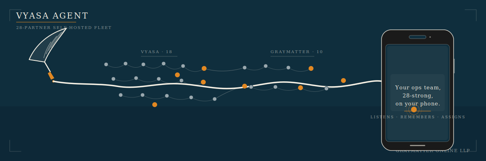

# Vyasa Agent v0.1.0a1 — The Duo Drop

<p align="center"><a href="../../assets/hero.svg"></a></p>

Released **2026-04-24**. First public alpha.

## TL;DR

You can now install a 29-partner specialist fleet on a Mac Mini or Debian
box, message it from your phone over Telegram, and keep every byte in a
local SQLite graph. Duo mode holds Dr. Sarabhai and Prometheus warm on
boot; the remaining 27 partners lazy-load on first address. The admin
backend is live; the React UI lands in v0.2.

```
uv tool install vyasa-agent
vyasa doctor
vyasa gateway serve --telegram
```

## Who this is for

- **Indian indie operators** running a handful of businesses from one
  phone, who want a named specialist on each thread instead of one
  generalist assistant.
- **Self-hosters** who want their customer data, legal files, and
  personal memory to live on a box they own.
- **Telegram-first teams** who want an agent they can address from the
  same chat surface their ops already flow through.
- **White-label resellers** who need to ship a branded agent fleet to
  their own clients with zero donor strings in the artefact.

If you want a cloud chatbot with a shared model and no memory boundary,
this is not that. Vyasa runs on your hardware.

## What works today

- **Console adapter** — local dev loop with no external services.
- **Telegram adapter** — polling on python-telegram-bot v22 with chat-id
  allowlist, quoted replies, and streaming edit-message replies at a
  1.0s cadence.
- **Router** — `/ask`, `@mention`, sticky binding with a 10-minute TTL,
  and an orchestrator-routed default. Alias resolution folds case and
  separators.
- **29-partner fleet** — 19 Vyasa mythic partners + 10 Graymatter
  Doctors, each with a verbatim system prompt and a scoped tool set.
  Deep-merge inheritance from YAML descriptors.
- **Capability matrix** — 29x20 grid, 3-layer enforcement (boot filter,
  runtime hook, audit log), handoff routing on denial.
- **Graphify v2** — SQLite + WAL store at `~/.vyasa/graph.sqlite`,
  schema v2 with visibility / owner / episode / supersede / TTL fields,
  8 typed edge kinds, PII scrubber (+91 phone, email, PAN, Aadhaar,
  OTP context) fail-closed on write, Compactor pipeline, MCP stdio
  server with 4 tools, v1-to-v2 migration script.
- **Admin backend** — FastAPI scaffold, 24 default settings across
  Fleet / Channels / Memory / Integrations / Branding, RFC 7807
  problem+json errors, trace-id middleware, bearer + session cookie +
  double-submit CSRF on write routes.
- **SettingsStore overlay** — admin edits hot-reload into the fleet
  without restarting; YAML source stays untouched.
- **Routines** — cron and webhook-triggered plans per partner;
  5 routines ship in-box (morning briefing, weekly retro, license
  health, capability audit, graph compaction).
- **CLI** — `vyasa gateway serve`, `vyasa employee list|show|enable|
  disable`, `vyasa graph query|migrate`, `vyasa doctor`, `vyasa
  version`. SIGTERM drains for 30s.
- **CI and supply chain** — 7 workflows (test on ubuntu+macos x
  py3.11/py3.12, ruff lint, white-label scanner, license check,
  multi-arch Docker with cosign OIDC keyless, tag-driven PyPI trusted
  publish, CodeCanyon Envato bundle). Dependabot weekly.
- **Brand** — hero, architecture, logo (light/dark), favicon, and 29
  tier-coloured roster badges in the midnight teal / ivory / saffron
  palette.

## Known limitations

Three things are deliberately stubbed in this alpha and land in v0.2:

1. **Real inference wiring.** The vendored runtime under
   `vendor/vyasa_internals` is signature-faithful but the turn bodies
   are stubbed. Set `VYASA_STUB_BRIDGE=1` to run the reversed-text stub
   for offline tests. Phase 2 restores the full inference loop.
2. **WhatsApp adapter.** v0.1-alpha ships console + Telegram only. The
   Baileys-grade WhatsApp sidecar (voice notes, images, multi-device)
   is the v0.2 scope.
3. **Admin panel UI.** The FastAPI backend is live with every route
   decisioned, but the React admin UI ships in v0.2. For now you tune
   the fleet via `SettingsStore` writes or the CLI.
4. **Envato buyer-license verification.** The installer build currently
   runs without a live Envato-key check. The fail-closed, time-boxed
   cache route lands before the CodeCanyon listing opens.
5. **Hindi and Gujarati input, IST defaults, UPI intent parsing, and
   the festival calendar** — English partner voices only in this alpha.

Also: MCP subprocess wire test is skipped (`3c1a6a7`) — the store is
exercised inproc only in v0.1. See `CHANGELOG.md` for the full fix log.

## Install

```
uv tool install vyasa-agent
vyasa doctor
```

`vyasa doctor` runs 4 offline checks and exits 0 on success or 2 on any
failure, so you can gate CI on it.

To start the gateway against Telegram you will need three env vars:

```
export VYASA_TELEGRAM_TOKEN=...
export VYASA_TELEGRAM_ALLOWLIST=123456789
export VYASA_TELEGRAM_WEBHOOK_SECRET=...
vyasa gateway serve --telegram
```

Or stay local with `vyasa gateway serve --console`.

Docker, launchd, systemd-user, and Fly.io recipes are in
[`docs/install.md`](../install.md). The partner directory with tool
scope and blocking flags is in [`docs/roster.md`](../roster.md).

## Upgrade from…

First alpha — no upgrade path yet. If you are migrating from a v1
Graphify store you built against an earlier branch, `vyasa graph
migrate` remaps legacy edge kinds and runs dry by default.

## Verify the release

The release artefact ships with a `SHA256SUMS` file and a cosign-signed
multi-arch Docker image. The GitHub release is published by
`release.yml` on tag push, via PyPI trusted publisher. No manual
credentials change hands.

## Thanks

Built by the 29-partner fleet itself, hand-in-hand with the operator
who wanted a team that fits in one pocket. File issues on GitHub; every
bug gets triaged by Dharma and fixes land on main. Bigger features
queue into the v0.2 plan.
